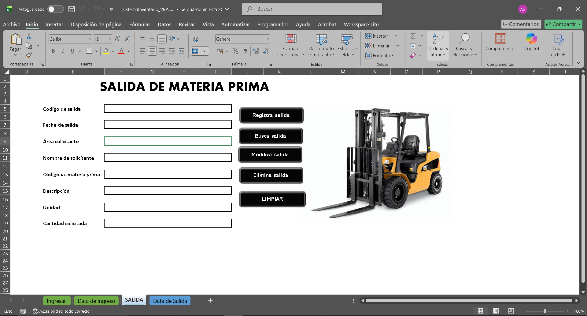

# Sistema de Inventario en Excel (VBA)

Sistema de inventario en Excel usando macros (VBA) para registrar y controlar entradas/salidas.

## Funcionalidades
- Registro de materia prima (formulario)
- Salida de materia prima
- Buscar / Modificar / Eliminar (CRUD)
- Automatización mediante macros (VBA)

## Tecnologías
- Microsoft Excel (.xlsm)
- VBA (Macros)

## Cómo usar
1) Descargar `SistemaInventario_VBA.xlsm`  
2) Abrir en Microsoft Excel  
3) Click en **Habilitar edición** (si aparece)  
4) Click en **Habilitar macros / Habilitar contenido**

**Si Windows lo bloquea:**
- Clic derecho al archivo → **Propiedades** → marcar **Desbloquear** → Aplicar → volver a abrir.
- 
## Evidencia

**Registro**

**Salida**

